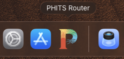
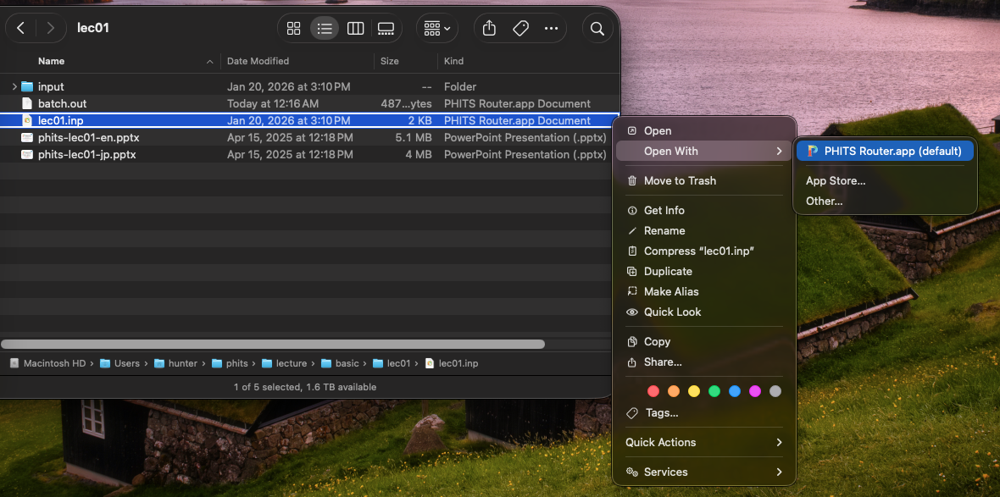
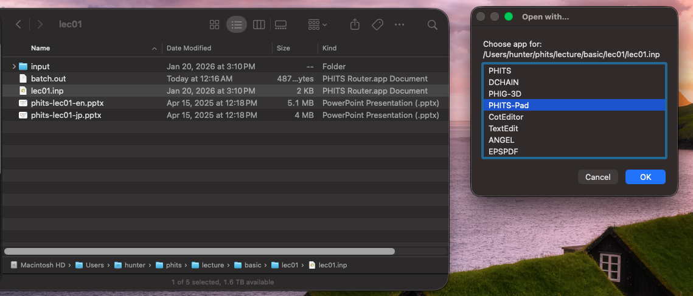

# PHITS Router (macOS)

PHITS Router is a small macOS utility built with Automator that acts as a
**smart dispatcher** for PHITS-related files.



It replaces the need to keep multiple PHITS-related apps in the Dock 
(PHITS, DCHAIN, ANGEL, PHIG-3D, and PHITS-Pad) and provides
a macOS-native equivalent to Windows’ “Send To” workflow using:

- file associations
- intelligent defaults
- modifier keys

The router works best when set as the default application for PHITS-related
file extensions.

PHITS is a general-purpose Monte Carlo particle simulation code; you can read 
more about it and how to get it at: https://phits.jaea.go.jp/

---

## Supported PHITS applications

PHITS Router expects a standard PHITS installation and uses the `PHITSPATH`
environment variable (with a fallback to `~/phits`).

Expected locations:

- PHITS: `$PHITSPATH/bin/PHITS.app`
- DCHAIN: `$PHITSPATH/bin/DCHAIN.app`
- ANGEL: `$PHITSPATH/bin/ANGEL.app`
- PHIG-3D: `$PHITSPATH/bin/PHIG3D_launch.app`
- PHITS-Pad: `$PHITSPATH/phitspad/macos/PhitsPad.app`
- EPSPDF: `$PHITSPATH/bin/EPSPDF.app`

---

## Recommended usage model

PHITS Router is designed primarily to be used via **file associations**, not
Dock drag-and-drop.

This is because macOS reliably provides modifier key state when files are
opened via:

- double-click
- Finder → Open With…
- right-click → Open With…

Modifier keys are *not* reliable for Dock drag-and-drop on modern macOS.



### Recommended setup

Associate PHITS Router with:

- `.inp`, `.in`, `.i`
- `.out`, `.o`
- any other PHITS-related extensions you use

Then:

- **Double-click** for the default behavior (open chooser)
- Hold modifier keys to choose alternate actions (execute, editor, etc.)

---

## File type detection

### PHITS input files
Recognized by extension:
- `.inp`, `.in`, `.i`

### DCHAIN input files
Detected by content:
- the first non-blank, non-comment line (not starting with `*` or `!`)
  contains the string `htitle` (case-insensitive)

### Text vs non-text
- Text files are detected using `file --mime-type`
- Non-text files are opened with the system default application
- `.eps` files are always opened with **EPSPDF**

---

## Modifier key behavior

### No modifier keys
- Always opens a chooser
- A sensible default is pre-selected

Default selection:
- PHITS input → **PHITS-Pad**
- DCHAIN input → **PHITS-Pad**
- Other text files → **preferred editor**
- `.eps` → EPSPDF (no chooser)



---

### Modifier keys (when opening a file)

When a modifier key is held as the file is opened, the file is sent directly to the application corresponding to the combination of the file type (PHITS input, DCHAIN input, other) and the modifier being held down, providing a very quick way to launch the various applications distributed with PHITS along with your text editor of choice.

#### PHITS input files
- **⇧ Shift** → PHITS-Pad
- **⌘ Command** → PHITS
- **⌥ Option** → PHIG-3D
- **⌃ Control** → preferred text editor

#### DCHAIN input files
- **⇧ Shift** → PHITS-Pad
- **⌘ Command** → DCHAIN
- **⌃ Control** → preferred text editor

#### Other text files (including PHITS output)
- **⇧ Shift** → PHITS-Pad
- **⌘ Command** → preferred text editor
- **⌥ Option** → ANGEL

---

## Chooser order

When the chooser is shown, applications appear in this order:

1. PHITS
2. DCHAIN
3. PHIG-3D
4. PHITS-Pad
5. Preferred text editor (default: CotEditor)
6. TextEdit (fallback)
7. ANGEL
8. EPSPDF

---

## Preferred editor

The preferred editor is configured in the AppleScript:

```applescript
set preferredEditorName to "CotEditor"
set fallbackEditorName to "TextEdit"
```


You can change this to any editor installed on your system, for example:

- BBEdit
- Visual Studio Code
- Sublime Text
- TextMate

If the preferred editor is not installed, TextEdit is used automatically.

---

## Installation

### Option A: Build from source (recommended)

1. Download `PHITS Router.workflow`
2. Open it in **Automator**
3. File → Convert To…
4. Choose **Application**
5. Save as `PHITS Router.app` (e.g. in `/Applications`)
6. Optionally assign a [custom icon](images/phits_logoA_1024x1024.png)
7. Associate PHITS file extensions with the app

### Option B: Use a prebuilt app
A prebuilt `.app` is provided in [GitHub Releases](https://github.com/Lindt8/phits-router-macos/releases):

1. Download and unzip `PHITS Router.app`
2. Move it to `/Applications`
3. Right-click → Open (first launch, Gatekeeper)
4. Associate file extensions

---

## File associations (macOS)

To associate a file type with PHITS Router:

1. Select a file (e.g. `.inp`)
2. ⌘I (Get Info)
3. Under **Open with:** choose `PHITS Router.app`
4. Click **Change All…**

Repeat for other extensions as desired.

---

## Debug mode

The script contains a debug mode flag:

```applescript
property debugMode : false
```


Set this to `true` to display diagnostic popups showing:
- detected file type
- DCHAIN detection
- modifier keys
- routing decisions

This is useful for troubleshooting and development.

---

## Notes on PHITSPATH

PHITS Router attempts to read `PHITSPATH` using a shell command.
If your PHITS installation does not expose `PHITSPATH` to GUI apps,
the script falls back to `~/phits`.

If needed, you may hardcode the path by editing:

```applescript
set phitsBase to ...
```


in the script.


